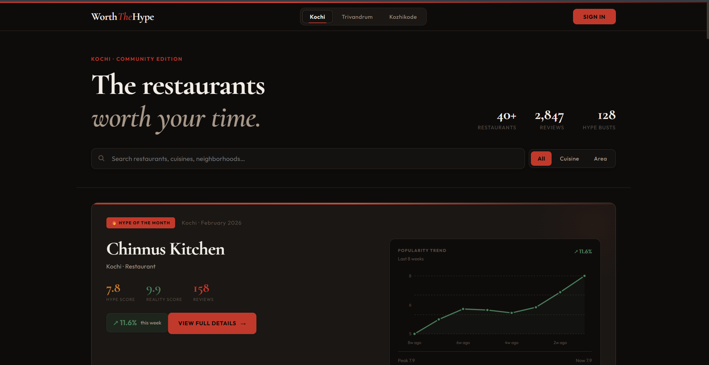
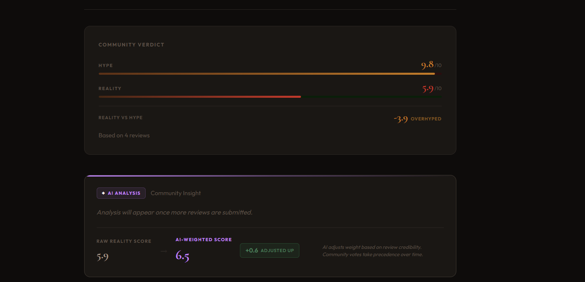
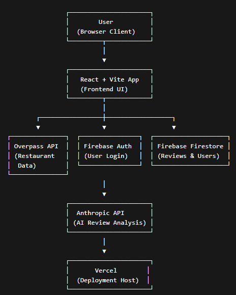

# WorthTheHype 🎯

WorthTheHype is a credibility-first, city-based restaurant discovery platform built for Kochi, Kerala.

Instead of showing what’s popular, it compares online hype with real user experience and surfaces the gap — called the **Delta**.

---

## 🔍 How It Works

- **Hype Score** – Online buzz  
- **Reality Score** – First-hand community reviews  
- **Delta** – Difference between perception and reality  

**Positive delta** → Worth visiting  
**Negative delta** → Likely overhyped  

---

## 🧠 AI 

- Evaluates review text for specificity and tone  
- Tags reviews as **Likely Genuine** or **Low Confidence**  
- Generates a neutral community summary per restaurant  
- AI never removes reviews — it only affects influence  

---

## Basic Details

**Team Name:** BarelyRight  

**Team Members:**
- Aleena Johny – (College)  
- Aswathy K A – (College)  

**Hosted Project Link:**  
https://worththehype001.vercel.app/

---

## Project Description

WorthTheHype is a city-based restaurant discovery platform that compares online hype with real user experiences. It helps users identify whether a restaurant is genuinely worth visiting or simply overhyped.

---

## The Problem Statement

Food discovery platforms often prioritize popularity and promotions, leading users to visit overhyped restaurants with poor real-world experiences. Fake reviews, bots, and promotional content further reduce trust in existing systems.

---

## The Solution

WorthTheHype introduces a credibility-first approach by separating hype from reality. It uses community-driven reviews, visible account credibility, and AI-assisted review analysis to surface honest dining experiences instead of promotional noise.

---

## Technical Details

### Technologies / Components Used

#### For Software
- **Languages:** JavaScript  
- **Frameworks:** React, Vite  
- **Libraries:** React Router DOM  
- **Tools:** VS Code, Git, GitHub, Vercel  

#### For Hardware
- Not applicable (Web-based project)

---

## Features

- Dual-score system: **Hype Score vs Reality Score**
- Delta-based verdict (**Worth the Hype / Overhyped**)
- City-based restaurant discovery (Kochi)
- AI-assisted review credibility tagging
- Reputation-aware user reviews
- Clean, responsive UI

---

## Implementation

### Installation
```bash
npm install
```

### Run
```bash
npm run dev
```

---

## Project Documentation

### Home Feed



Kochi dashboard displaying restaurants ranked by Hype vs Reality scores with search, filters, and trending highlights.


---


Restaurant detail page showing community reviews with reputation tiers, voting, AI confidence tags, and separate Hype/Reality ratings.

---



Final verdict section summarizing aggregated scores with delta classification and AI-weighted adjustment for review credibility.

---

## Diagrams

### System Architecture



---

## Application Workflow

1. User opens application  
2. Selects city (Kochi)  
3. Browses restaurant list (Hype vs Reality)  
4. Searches / filters restaurants  
5. Views restaurant details  
6. Reads community reviews  
7. AI evaluates review credibility  
8. Community votes influence scores  
9. User logs in (optional)  
10. Submits review (Hype + Reality)  
11. Scores update and verdict recalculates  

---

## Additional Documentation

### API Documentation

#### Base URLs

**Overpass API (Restaurant Data)**
- https://overpass.kumi.systems/api/interpreter  
- https://maps.mail.ru/osm/tools/overpass/api/interpreter  
- https://overpass-api.de/api/interpreter  

**Anthropic API (AI Review Analysis)**
- https://api.anthropic.com/v1/messages  

---

### Endpoints Used

#### Overpass API

- **Endpoint:** `POST /api/interpreter`
- **Description:** Fetches restaurant data within a predefined city bounding box (Kochi) using Overpass QL queries.
- **Request Parameter:**
  - `query` (string) — Overpass QL query containing geographic bounding box and amenity filters.
- **Response:**
  - Restaurant name  
  - Latitude & longitude  
  - Tags (cuisine, locality, amenity type)  

---

#### Anthropic API

- **Endpoint:** `POST /v1/messages`
- **Model Used:** `claude-sonnet-4-20250514`
- **Description:**
  - Generates a neutral community summary  
  - Classifies review credibility (Likely Genuine / Low Confidence / Promotional)
